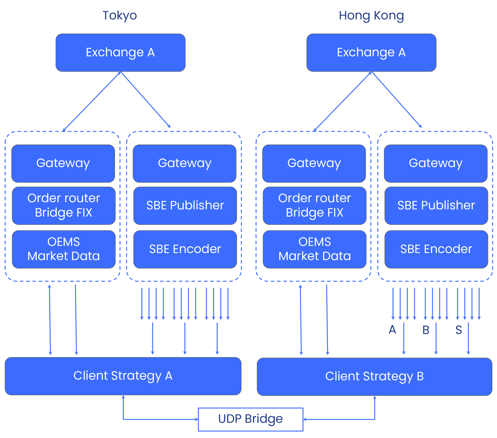

# Phoenix Prime FIX Client Examples 

This repository provides a reference implementation of FIX based trading client connecting to __Phoenix Prime__.
It illustrates how to use the FIX protocol of __Phoenix Prime__ for order execution and to obtain streaming market 
data. 

The FIX client is built on top of the [QuickFix](https://quickfixengine.org) open source FIX library and application framework.

Porting the Client Trading Application to C++, Java or Go is straightforward as QuickFix is available 
for all of these programming languages. Porting it to another FIX library should not be difficult as it illustrates
how to properly setup the different outgoing FIX messages and how to parse the incoming FIX messages. 


## Technical Overview of Phoenix Prime

__Phoenix Prime__ provides order execution through the FIX protocol. It currently supports FIX version 4.4 
with some small custom modifications. 


On the left hand side the FIX based order execution path is depicted, which optionally can also deliver market
data as FIX messages. 

In order to facilitate cross exchange trading, the client can deploy a strategy multiple times in 
collocation to the desired trading venue. 



Here the same stack as for the single exchange trading is deployed multiple times. The client then can use 
a UDP or TCP connection between the strategies to exchange information and data.

Market data can be obtained through FIX as well. __Phoenix Prime__ also provides a faster and more efficient 
UDP multicast protocol with Simple Binary Encoding (SBE), which is illustrated on the right hand side in the 
above [diagram](docs/single_exchange.png).

Client libraries for C++, Java, Go and Python, implementing a fully functional UDP receiver and a SBE decoder:
  - [C++ SBE Client Library](https://github.com/mtxpt/phx-sbe-receiver-cpp)
  - [Java SBE Client Library](https://github.com/mtxpt/phx-sbe-receiver-java)
  - [Go SBE Client Library](https://github.com/mtxpt/phx-sbe-receiver-go)
  - [Python SBE Client Library](https://github.com/mtxpt/phx-sbe-receiver-py)

The __Phoenix Prime__ market data UDP multicast protocol closely follows the [CME design](https://www.cmegroup.com/confluence/display/EPICSANDBOX/CME+Benchmark+Administration+Premium+-+SBE+UDP+Multicast).
A similar market data service is also offered by [Deribit](https://insights.deribit.com/exchange-updates/launch-of-our-new-multicast-service/).
Lately, Binance also started to experiment with the SBE protocol for market data distribution. 


## FIX Client Quick Start Tutorial

### Connecting to Phoenix FIX Services 

The FIX client needs to provide a session configuration with consists of two parts: 
First part are the account login credentials
``` 
Username=trader
Password=secret
FixAuthenticationMethod=hmac_sha256
Account=A1
``` 

The second part are the FIX specific settings, including the FIX server host IP and socket port
``` 
SenderCompID=client
TargetCompID=phoenix-prime
SocketConnectPort=1238
SocketConnectHost=127.0.0.1
```

These configurations are usually passed to the FIX application in a
client specific configuration file `client.cfg` in the `[SESSION]` section.

Note that QuickFix also requires in the `[SESSION]` configuration section a reference to a
FIX schema file. __Phoenix Prime__ uses the schema provided in `phx/fix_spec/FIX44.xml`.


### Running a FIX Based Trading Strategy 

The submodule `phx.strategy.random` contains a fully functional FIX trading application, which 
provides useful standard trading functionalities such as

  - Get the security list of the exchange 
  - Subscribe to market data
  - Get instrument meta data from the exchange
  - Get initial position snapshot and wallet balances from the trading account
  - Get initial working orders from the trading account
  - Send requests for new order and order canceling 
  - Parse FIX messages and represent them with Python objects
  - Keep track of the order book of selected symbols 

It also implements basic OEM services such as tracking the state of orders and positions 
from FIX execution reports. 

The strategy code uses API classes from `phx-fix-base` package.
#### Install `phx-fix-base` package
1. Clone GitHub repository to your computer `% git clone git@github.com:mtxpt/phx-fix-base.git`.
2. In `phx-fix-examples` folder run `% source <phx-fix-examples>/opt/conda/bin/activate dev`
3. `pip install git+file:///<full path to phx-fix-base>`
4. Note: to reinstall a new version of `phx-fix-base` package run `pip uninstall phx-fix-base` and then install command from the previous step.

#### Configure the strategy
The strategy can be configured via the `<phx-fix-examples>/src/phx/strategy/random/random_strategy.yaml` file.

#### Run the strategy
To run the trading application, 
```bash
% source <phx-fix-examples>/opt/conda/bin/activate dev
% cd <phx-fix-examples>/src/phx/strategy/random
% ./start.sh
or 
% python3 main.py
```

## FIX Protocol Pointers

For those who do not know enough about FIX you can learn more here

  - [QuickFix documentation](https://quickfixengine.org/c/documentation/)
  - [Online FIX parser](https://www.esprow.com/fixtools/parser.php)
  - [FIX 4.4 dictionary](https://www.onixs.biz/fix-dictionary/4.4/msgs_by_msg_type.html)
  - [Proof blog](https://medium.com/prooftrading/proof-engineering-fix-gateways-264dcda8be71)

The online FIX parser is particularly useful to understand FIX message strings quickly. 


## Installation 

It is highly recommended to create a new Python environment. The script
`scripts/setup_all.sh` automates the creation of a conda based environment 
with all dependencies installed. Optionally provide the argument `clean` to 
remove existing environment and rebuild all. 

```
scripts/setup_all.sh [clean]
```

Note that `setup_all.sh` also builds a custom QuickFix version for `arm64` architecture. 

By specifying environment variable `ROOT_CERTIFICATE` a root certificate is 
used to configure the global certificate used by `pip3 install` and `conda install`.

Alternatively a Python environment can be created and the `requirements.txt` can 
be installed directly as follows 

``` 
pip3 install -r requirements.txt
```

Note that `requirements.txt` does not install QuickFix for macOS with arm64 architecture
as the current QuickFix version 1.15.1 has some issues and requires a patch. 


## Custom Build QuickFix for arm64 on macOS 

Building QuickFix for Apple arm64 requires a patch. The following script
automates the patch and builds QuickFix for `arm64` from source:

```
scripts/build_quickfix_arm64.sh
```

If you use `setup_all.sh` you don't have to execute this build step as it is handled 
by `setup_all.sh` as well. 


## Installing QuicFix on Windows

The Python QuickFIX bindings also fail to install on Windows. Fortunately, for Windows there are 
[prebuilt wheel packages](https://www.lfd.uci.edu/~gohlke/pythonlibs/#quickfix). 

To setup the Python environment using Conda follow these steps:

  - Install Conda or Miniconda
  - Create a new environment with `conda create --name phx python=3.9`
  - Activate the environment
  - Install all dependencies first `pip install -r requirements.txt` 
  - Download the QuickFix wheel `quickfix‑1.15.1‑cp39‑cp39‑win_amd64.whl`
  - Install the wheel `pip install quickfix‑1.15.1‑cp39‑cp39‑win_amd64.whl`
  - List packages and check if `quickfix 1.15.1` shows up `conda list`

Note that during the execution of `pip install -r requirements.txt` you should first see

```
Ignoring quickfix: markers 'platform_machine != "arm64" and sys_platform != "win32"' don't match your environment
```


## Configure PyCharm

To conveniently work with PyCharm it must be configured to use the proper interpreter.
Set the Python interpreter managed by the Conda package manager in `./opt/conda/`

Lower right corner in PyCharm choose "Python Interpreter". Then

  - `Add New Interpreter` -> `Add Local Interpreter`
  - Choose `Conda Environment` with conda executable `<path to>/opt/conda/condabin/conda` 
  - Click the button `Load Environments`, make sure the radio button `Use existing environment` is selected
  - Choose `dev` and give it optionally another name by editing the interpreter configuration

PyCharm can also be configured for Remote Development. This allows to run the project on the server,
while using PyCharm client.


## Writing Your Own Trading Application 

In order to accelerate the development of FIX based trading application we provide some abstractions 
on top of the plain [QuickFix](http://www.quickfixengine.org/) application interface. Other FIX 
engines can be supported in a similar way.

Note that this library builds on QuickFix which is developed by [quickfixengine.org](http://www.quickfixengine.org/).
Check their [license agreement](http://www.quickfixengine.org/LICENSE) for licensing information.


